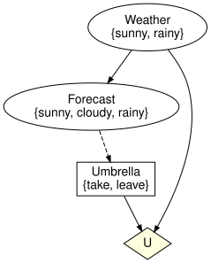
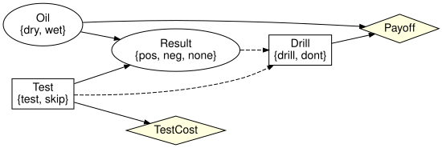

# Influence diagrams as attributed C-sets
Simon Frost

- [Overview](#overview)
- [Setup](#setup)
- [The schema](#the-schema)
- [Building a diagram](#building-a-diagram)
- [Information arcs are not causal
  arcs](#information-arcs-are-not-causal-arcs)
- [Utilities are not variables](#utilities-are-not-variables)
- [Precedence and sequential
  decisions](#precedence-and-sequential-decisions)
- [Validation](#validation)
- [From and to Bayesian networks](#from-and-to-bayesian-networks)
- [Summary](#summary)
- [References](#references)

## Overview

An influence diagram ([Howard and Matheson
2005](#ref-HowardMatheson2005)) extends a Bayesian network with
decisions, the information available when each decision is taken,
utility functions and a decision order (SPEC section 23).
`InfluenceDiagrams.jl` represents it as an attributed C-set over the
schema `SchInfluenceDiagram`, which extends the `SchBayesNet` schema of
`BayesianNetworks.jl` with five objects:

| object | meaning | homs |
|----|----|----|
| `Decision` | a decision controlling an action variable | `decision_variable` |
| `InformationInput` | one variable known when a decision is taken | `information_decision`, `information_variable` |
| `Utility` | a utility node |  |
| `UtilityInput` | one variable read by a utility node | `utility_node`, `utility_variable` |
| `DecisionPrecedence` | an explicit ordering of two decisions | `earlier`, `later` |

The three kinds of arc of SPEC section 23 (causal, informational, value)
are three different objects, so they can never be confused: a causal
`Input` feeds a mechanism, an `InformationInput` feeds a decision, a
`UtilityInput` feeds a utility node. The representation choices this
settles – separate value nodes, information arcs that are not causal, an
explicit decision order – are the ones surveyed by Bielza et al.
([2011](#ref-BielzaGomezShenoy2011)).

Two conditions on the decision order are worth keeping apart from the
start. Shachter ([1986](#ref-Shachter1986)) calls a diagram *regular*
when a directed path runs through all the decisions; *no-forgetting*
(perfect recall) is the stronger property that everything known at a
decision is still known at every later one. `validate` requires neither,
because a diagram that forgets is a well-formed limited-memory influence
diagram ([Lauritzen and Nilsson 2001](#ref-LauritzenNilsson2001)).

## Setup

``` julia
using InfluenceDiagrams
using Graphs   # `ne` counts the edges of the `SimpleDiGraph`s returned below
```

## The schema

``` julia
SchInfluenceDiagram
```

    ACSets.Schemas.BasicSchema{Symbol}([:Variable, :State, :Mechanism, :Input, :Decision, :InformationInput, :Utility, :UtilityInput, :DecisionPrecedence], [(:state_variable, :State, :Variable), (:target, :Mechanism, :Variable), (:input_mechanism, :Input, :Mechanism), (:input_variable, :Input, :Variable), (:decision_variable, :Decision, :Variable), (:information_decision, :InformationInput, :Decision), (:information_variable, :InformationInput, :Variable), (:utility_node, :UtilityInput, :Utility), (:utility_variable, :UtilityInput, :Variable), (:earlier, :DecisionPrecedence, :Decision), (:later, :DecisionPrecedence, :Decision)], [:Label, :Position, :Ref], [(:variable_name, :Variable, :Label), (:space_ref, :Variable, :Ref), (:state_name, :State, :Label), (:state_position, :State, :Position), (:mechanism_name, :Mechanism, :Label), (:kernel_ref, :Mechanism, :Ref), (:input_position, :Input, :Position), (:decision_name, :Decision, :Label), (:utility_name, :Utility, :Label), (:utility_ref, :Utility, :Ref), (:information_position, :InformationInput, :Position), (:utility_position, :UtilityInput, :Position)], Tuple{Union{Nothing, Symbol}, Symbol, Symbol, Tuple{Tuple{Vararg{Symbol}}, Tuple{Vararg{Symbol}}}}[])

The same schema is defined in the Lean project under `proofs/`, which
emits `proofs/schemas/influence_diagram.schema.json`; the test suite
checks that `schema_json(SchInfluenceDiagram)` agrees with it.

``` julia
sj = schema_json(SchInfluenceDiagram)
[d["name"] for d in sj["Ob"]]
```

    9-element Vector{String}:
     "Variable"
     "State"
     "Mechanism"
     "Input"
     "Decision"
     "InformationInput"
     "Utility"
     "UtilityInput"
     "DecisionPrecedence"

## Building a diagram

`influence_diagram` mirrors `bayesnet`: variables with their states,
mechanisms with ordered parents, decisions with ordered information sets
and utilities with ordered scopes. The umbrella problem has a chance
variable `Weather`, a forecast that depends on it, a decision `Umbrella`
that sees the forecast, and a utility over the weather and the action.

``` julia
id = influence_diagram(:Weather => [:sunny, :rainy],
                       :Forecast => [:sunny, :cloudy, :rainy],
                       :Umbrella => [:take, :leave];
                       mechanisms = [:Forecast => :Weather],
                       decisions = [:Umbrella => :Forecast],
                       utilities = [:U => (:Weather, :Umbrella)])
```

<div class="c-set">
<span class="c-set-summary">InfluenceDiagrams.InfluenceDiagram {Variable:3, State:7, Mechanism:2, Input:1, Decision:1, InformationInput:1, Utility:1, UtilityInput:2, DecisionPrecedence:0, Label:0, Position:0, Ref:0}</span>

| Variable | variable_name | space_ref |
|---------:|--------------:|----------:|
|        1 |       Weather |   NoRef() |
|        2 |      Forecast |   NoRef() |
|        3 |      Umbrella |   NoRef() |

| State | state_variable | state_name | state_position |
|------:|---------------:|-----------:|---------------:|
|     1 |              1 |      sunny |              1 |
|     2 |              1 |      rainy |              2 |
|     3 |              2 |      sunny |              1 |
|     4 |              2 |     cloudy |              2 |
|     5 |              2 |      rainy |              3 |
|     6 |              3 |       take |              1 |
|     7 |              3 |      leave |              2 |

| Mechanism | target |     mechanism_name | kernel_ref |
|----------:|-------:|-------------------:|-----------:|
|         1 |      2 | Forecast_mechanism |    NoRef() |
|         2 |      1 |  Weather_mechanism |    NoRef() |

| Input | input_mechanism | input_variable | input_position |
|------:|----------------:|---------------:|---------------:|
|     1 |               1 |              1 |              1 |

| Decision | decision_variable | decision_name |
|---------:|------------------:|--------------:|
|        1 |                 3 |      Umbrella |

| InformationInput | information_decision | information_variable | information_position |
|---:|---:|---:|---:|
| 1 | 1 | 2 | 1 |

| Utility | utility_name | utility_ref |
|--------:|-------------:|------------:|
|       1 |            U |     NoRef() |

| UtilityInput | utility_node | utility_variable | utility_position |
|-------------:|-------------:|-----------------:|-----------------:|
|            1 |            1 |                1 |                1 |
|            2 |            1 |                3 |                2 |

</div>

Every object is inspectable. Decisions are named after their action
variable unless told otherwise, and the information set is returned in
`information_position` order, the domain order of the decision’s policy.

``` julia
decision_names(id), information_names(id, :Umbrella), utility_scope_names(id, :U)
```

    ([:Umbrella], [:Forecast], [:Weather, :Umbrella])

``` julia
action_names(id), chance_names(id)
```

    ([:Umbrella], [:Weather, :Forecast])

## Information arcs are not causal arcs

The forecast informs the umbrella decision, but nothing generates the
umbrella: the action variable has no mechanism and no parents. The
derived causal graph (`variable_graph`) only contains
`Weather -> Forecast`.

``` julia
has_mechanism(id, :Umbrella), parents(id, :Umbrella)
```

    (false, Int64[])

`information_graph` adds the dashed arcs (information variable to
action) and the explicit precedence; the declared information is
consistent when it is acyclic, and `decision_order` reads the order of
the decisions off it. Acyclicity is weaker than *no-forgetting* (perfect
recall), which decision variable elimination needs and which
`no_forgetting_arcs` and `with_no_forgetting` report and repair;
vignette 04 covers it.

``` julia
ne(variable_graph(id)), ne(information_graph(id))
```

    (1, 2)

`to_graphviz` draws all three kinds of arc: chance variables are
ellipses, decisions are boxes, utilities are diamonds, and information
arcs are dashed.

``` julia
to_graphviz(id)
```



## Utilities are not variables

A utility node has no states and cannot be the parent of anything,
because it is not a `Variable`; SPEC section 37 item 5 (“utility nodes
have no children”) holds by construction.

``` julia
has_variable(id, :U), nparts(id, :Utility), nparts(id, :UtilityInput)
```

    (false, 1, 2)

## Precedence and sequential decisions

With several decisions, the order is induced by the arcs: an action that
informs (or causally affects an information variable of) another
decision precedes it. The two-stage test-then-act example of
`two_stage_diagram` has `Test` before `Drill` because `Drill` observes
`Test` and the test result.

``` julia
t = two_stage_diagram()
decision_name.(Ref(t), decision_order(t))
```

    2-element Vector{Symbol}:
     :Test
     :Drill

``` julia
to_graphviz(t; rankdir = "LR")
```



Unordered decisions can be ordered explicitly with `add_precedence!` (or
the `precedence` keyword); a precedence that contradicts the arcs is a
validation error.

``` julia
add_precedence!(t, :Drill => :Test)
try
    validate(t)
catch e
    e
end
```

    DecisionPrecedenceCycleError([:Test, :Drill])

## Validation

`validate` runs the structural checks of BayesianNetworks.jl on the
chance part and the twelve checks of SPEC section 37 on the decision
part, throwing a typed error for the first violation;
`validation_errors` lists all of them. With `closed = true` every
variable must have exactly one generator: a chance mechanism or a
decision.

``` julia
validate(id; closed = true)
```

An information variable downstream of the action is not available when
the decision is taken:

``` julia
bad = influence_diagram(:Weather => [:sunny, :rainy], :Umbrella => [:take, :leave],
                        :Wet => [:no, :yes];
                        mechanisms = [:Wet => (:Weather, :Umbrella)],
                        decisions = [:Umbrella => :Wet], utilities = [:U => :Wet])
validation_errors(bad)
```

    1-element Vector{Exception}:
     InvalidInformationSetError(:Umbrella, :Wet, :downstream)

An action variable with a chance mechanism, or controlled by two
decisions, violates decision uniqueness:

``` julia
dup = umbrella_diagram()
add_mechanism!(dup, :Umbrella; inputs = [:Forecast])
validation_errors(dup)
```

    1-element Vector{Exception}:
     DecisionUniquenessError(:Umbrella, :Umbrella, :has_mechanism)

## From and to Bayesian networks

An `InfluenceDiagram` is also an `AbstractBayesNet`, so every inspection
function of BayesianNetworks.jl applies to it, and the two types convert
into each other by copying the shared objects (the pullback data
migration along the schema inclusion). `BayesNet(id)` drops the decision
layer and leaves the action variables without a mechanism, an open
network; `InfluenceDiagram(bn)` is the starting point for adding
decisions to an existing network.

``` julia
bn = BayesNet(id)
nparts(bn, :Mechanism), has_mechanism(bn, :Umbrella)
```

    (2, false)

``` julia
id2 = InfluenceDiagram(bn)
add_decision!(id2, :Umbrella; information = [:Forecast])
add_utility!(id2, :U; scope = [:Weather, :Umbrella])
is_isomorphic(id2, id)
```

    true

Diagrams serialise to JSON in the same envelope as networks
(`json_influence_diagram`), and `canonicalize` renumbers parts
deterministically so that diagrams built in different orders compare
equal.

## Summary

An influence diagram is one ACSet over `SchInfluenceDiagram`, so
decisions, information sets, utilities and the decision order are data
of the same structure as the underlying Bayesian network, and the three
kinds of arc are three different schema objects rather than a
convention. `validate` checks what makes the diagram well-formed –
acyclicity, resolvable references, consistent information sets – and
deliberately not no-forgetting, and `BayesNet`/`InfluenceDiagram` move
between the two schemas without loss. The next vignette, *Policies and
expected utility*, binds numbers to this syntax and computes what a
strategy is worth.

## References

<div id="refs" class="references csl-bib-body hanging-indent">

<div id="ref-BielzaGomezShenoy2011" class="csl-entry">

Bielza, Concha, Manuel Gómez, and Prakash P. Shenoy. 2011. “A Review of
Representation Issues and Modeling Challenges with Influence Diagrams.”
*Omega* 39 (3): 227–41. <https://doi.org/10.1016/j.omega.2010.07.003>.

</div>

<div id="ref-HowardMatheson2005" class="csl-entry">

Howard, Ronald A., and James E. Matheson. 2005. “Influence Diagrams.”
*Decision Analysis* 2 (3): 127–43.
<https://doi.org/10.1287/deca.1050.0020>.

</div>

<div id="ref-LauritzenNilsson2001" class="csl-entry">

Lauritzen, Steffen L., and Dennis Nilsson. 2001. “Representing and
Solving Decision Problems with Limited Information.” *Management
Science* 47 (9): 1235–51. <https://doi.org/10.1287/mnsc.47.9.1235.9779>.

</div>

<div id="ref-Shachter1986" class="csl-entry">

Shachter, Ross D. 1986. “Evaluating Influence Diagrams.” *Operations
Research* 34 (6): 871–82. <https://doi.org/10.1287/opre.34.6.871>.

</div>

</div>
