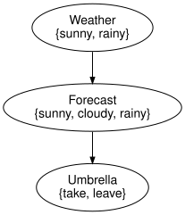

# Policies, instantiation and expected utility
Simon Frost

- [Overview](#overview)
- [Setup](#setup)
- [Policies](#policies)
- [Strategies](#strategies)
- [Instantiate: the central
  reduction](#instantiate-the-central-reduction)
- [Expected utility](#expected-utility)
- [Summary](#summary)
- [References](#references)

## Overview

The syntax of the first vignette says which variables exist and who
reads what. The `InfluenceDiagramModel` adds the numbers: chance
kernels, utility functions and a strategy of policies. This vignette
follows SPEC sections 26 to 31 on the umbrella problem: policies as
kernels, the central reduction `instantiate` (Proposition 5) and the
reference computation of expected utility (Proposition 6).

## Setup

``` julia
using InfluenceDiagrams
m = umbrella_model()
```

    InfluenceDiagramModel(3 variables, 1 decision, 1 utility, 2 kernels, 1 bound)

`umbrella_model` binds the numbers of Shachter
([1986](#ref-Shachter1986)) to `umbrella_diagram`: the weather is sunny
with probability 0.7, the forecast is right most of the time, and the
utility rewards leaving the umbrella at home when it is sunny.

``` julia
cpt(kernel(m, :Forecast))
```

    2×3 Matrix{Float64}:
     0.7   0.2   0.1
     0.15  0.25  0.6

``` julia
utility_table(utility(m, :U))
```

    2×2 Matrix{Float64}:
     20.0  100.0
     70.0    0.0

## Policies

A policy for decision $D$ is a stochastic kernel from its information
set to its action space, $\delta_D : I_D \to A_D$. Three kinds are
provided:

- `DeterministicPolicy`: a table, dictionary or function from
  information states to actions;
- `StochasticPolicy`: any normalised `FiniteKernel` with the right
  domain and codomain;
- `ConstantPolicy`: always the same action, whatever the information.

`deterministic_policy` reads the axes from the model, so only the rule
has to be given.

``` julia
take_when_rainy = deterministic_policy(m, :Umbrella, f -> f == :rainy ? :take : :leave)
policy_table(take_when_rainy)
```

    3-element Vector{Symbol}:
     :leave
     :leave
     :take

`policy_kernel` is the kernel that `instantiate` binds to the decision:
a one-hot kernel for a deterministic policy, the kernel itself for a
stochastic one, and the discard-then-point-mass kernel for a constant
one (which needs the spaces of the model).

``` julia
k = policy_kernel(take_when_rainy)
cpt(k)
```

    3×2 Matrix{Float64}:
     0.0  1.0
     0.0  1.0
     1.0  0.0

``` julia
cpt(policy_kernel(ConstantPolicy(:take), m, :Umbrella))
```

    3×2 Matrix{Float64}:
     1.0  0.0
     1.0  0.0
     1.0  0.0

Every policy is checked against its decision (`validate_policy`, SPEC
section 37 item 9): the information axes must match the information set
in order, the action axis must be the action variable’s, a constant must
be one of its states.

``` julia
try
    set_policy(m, :Umbrella, ConstantPolicy(:sideways))
catch e
    e
end
```

    PolicySignatureError(:Umbrella, :table, [:take, :leave], :sideways)

## Strategies

A `Strategy` holds one policy per decision. Models are immutable values:
`set_policy` and `fix_decision` return new models and leave the original
untouched.

``` julia
m1 = set_policy(m, :Umbrella, take_when_rainy)
m2 = fix_decision(m, :Umbrella => :leave)
strategy(m), strategy(m1), strategy(m2)
```

    (Strategy(), Strategy(Umbrella => DeterministicPolicy), Strategy(Umbrella => ConstantPolicy))

## Instantiate: the central reduction

Substituting a complete strategy into the diagram yields an ordinary
Bayesian network (SPEC section 28): each decision gets a mechanism named
`policy[D]` with reference `PolicyRef(D)`, whose inputs are the
information set in `information_position` order, and the
Bayesian-network part of the diagram is copied into a fresh `BayesNet`.
This is the only place where information arcs turn into causal inputs,
and only for the policies supplied.

``` julia
bn = instantiate(m1)
```

    BayesModel(3 variables, 3 mechanisms, 3 kernels)

``` julia
syntax(bn)
```

<div class="c-set">
<span class="c-set-summary">BayesianNetworks.BayesNet {Variable:3, State:7, Mechanism:3, Input:2, Label:0, Position:0, Ref:0}</span>

| Variable | variable_name | space_ref |
|---------:|--------------:|----------:|
|        1 |       Weather |   NoRef() |
|        2 |      Forecast |   NoRef() |
|        3 |      Umbrella |   NoRef() |

| State | state_variable | state_name | state_position |
|------:|---------------:|-----------:|---------------:|
|     1 |              1 |      sunny |              1 |
|     2 |              1 |      rainy |              2 |
|     3 |              2 |      sunny |              1 |
|     4 |              2 |     cloudy |              2 |
|     5 |              2 |      rainy |              3 |
|     6 |              3 |       take |              1 |
|     7 |              3 |      leave |              2 |

| Mechanism | target |     mechanism_name |                     kernel_ref |
|----------:|-------:|-------------------:|-------------------------------:|
|         1 |      2 | Forecast_mechanism | NamedRef("Forecast_mechanism") |
|         2 |      1 |  Weather_mechanism |  NamedRef("Weather_mechanism") |
|         3 |      3 | policy\[Umbrella\] |           PolicyRef(:Umbrella) |

| Input | input_mechanism | input_variable | input_position |
|------:|----------------:|---------------:|---------------:|
|     1 |               1 |              1 |              1 |
|     2 |               3 |              2 |              1 |

</div>

Proposition 5 says the result is a valid closed network, which is
checked structurally and numerically:

``` julia
validate(bn; closed = true, unique_names = true, semantics = true)
sum(joint_distribution(bn).table)
```

    1.0

``` julia
to_graphviz(bn)
```



The Lean development in `proofs/` proves the same statement for the
finite model (`closed_instantiate`, `sum_joint_instantiate_eq_one`) and
the factorisation of the joint law of SPEC section 31,
`joint_instantiate`.

## Expected utility

Under a strategy the joint law is
$P_\sigma(x) = \prod_X \kappa_X \prod_D \delta_D$, the total utility is
additive, $U(x) = \sum_j u_j(x)$, and
$EU(\sigma) = \sum_x P_\sigma(x) U(x)$ (Proposition 6).
`expected_utility` follows the reference algorithm of SPEC section 31
literally: instantiate, enumerate the joint by brute force, evaluate the
total utility of every assignment, take the expectation.

``` julia
expected_utility(m1)
```

    76.99999999999999

Fixed actions are the two extremes: always leaving the umbrella gives
70, always taking it 35. Pairs `:D => :a` are a shortcut for
`fix_decision`.

``` julia
expected_utility(m, :Umbrella => :leave), expected_utility(m, :Umbrella => :take)
```

    (69.99999999999999, 35.0)

Every deterministic policy of the decision can be enumerated; the best
of the eight is the one that reacts to a rainy forecast, with expected
utility 77.

``` julia
[(policy_table(p), expected_utility(m, Strategy(:Umbrella => p)))
 for p in all_deterministic_policies(m, :Umbrella)]
```

    8-element Vector{Tuple{Vector{Symbol}, Float64}}:
     ([:take, :take, :take], 35.0)
     ([:leave, :take, :take], 71.05)
     ([:take, :leave, :take], 40.949999999999996)
     ([:leave, :leave, :take], 76.99999999999999)
     ([:take, :take, :leave], 28.0)
     ([:leave, :take, :leave], 64.05)
     ([:take, :leave, :leave], 33.949999999999996)
     ([:leave, :leave, :leave], 69.99999999999999)

Fixing a decision and intervening on its action variable are different
operations (SPEC section 41). `fix_decision` keeps the decision and
gives it a constant policy; `do_intervention` on the action removes the
decision (with its information set) and installs a constant mechanism, a
physical override recorded in the history. For the same action they give
the same expected utility, but the diagrams differ.

``` julia
done = do_intervention(m, :Umbrella => :take)
nparts(syntax(m2), :Decision), nparts(syntax(done), :Decision), history(done)[1].note
```

    (1, 0, "removed decision Umbrella")

``` julia
expected_utility(m2), expected_utility(instantiate(done))
```

    (69.99999999999999, 35.0)

Evidence conditions the expectation: with a rainy forecast recorded by
`observe`, the posterior probability of rain is 0.72 and taking the
umbrella is worth more.

``` julia
e = observe(m, :Forecast => :rainy)
expected_utility(e, :Umbrella => :take), expected_utility(e, :Umbrella => :leave)
```

    (56.0, 27.999999999999996)

## Summary

A policy is an ordinary kernel from a decision’s information set to its
action, a strategy is one policy per decision, and `instantiate`
substitutes them into the syntax to produce a plain `BayesModel` – which
is why expected utility needs no new machinery beyond inference on that
model. Evidence conditions the expectation exactly as it conditions a
posterior. The next vignette, *Optimisation: exhaustive versus decision
variable elimination*, searches over strategies instead of evaluating a
given one.

## References

<div id="refs" class="references csl-bib-body hanging-indent">

<div id="ref-Shachter1986" class="csl-entry">

Shachter, Ross D. 1986. “Evaluating Influence Diagrams.” *Operations
Research* 34 (6): 871–82. <https://doi.org/10.1287/opre.34.6.871>.

</div>

</div>
