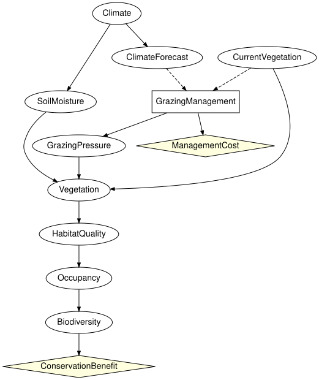

# Composing ecology and management
Simon Frost

- [Overview](#overview)
- [Setup](#setup)
- [Analysis 1: expected utility of each fixed
  action](#analysis-1-expected-utility-of-each-fixed-action)
- [Analysis 2: the optimal conditional
  policy](#analysis-2-the-optimal-conditional-policy)
- [Analysis 3: dropping the vegetation
  survey](#analysis-3-dropping-the-vegetation-survey)
- [Analysis 4: the value of observing the current
  vegetation](#analysis-4-the-value-of-observing-the-current-vegetation)
- [Analysis 5: direct intervention versus deciding under uncertain
  implementation](#analysis-5-direct-intervention-versus-deciding-under-uncertain-implementation)
- [Round trip through the file
  formats](#round-trip-through-the-file-formats)
- [Summary](#summary)
- [References](#references)

## Overview

SPEC section 46 extends the reference ecological network of section 45
with a grazing management decision, an uncertain implementation and two
utilities:

``` text
 Climate -> ClimateForecast                Climate -> SoilMoisture
 CurrentVegetation ---------------------> Vegetation -> HabitatQuality -> Occupancy -> Biodiversity
 GrazingManagement (decision) -> GrazingPressure -> Vegetation
 information: ClimateForecast, CurrentVegetation -> GrazingManagement
 utilities:   ConservationBenefit(Biodiversity), ManagementCost(GrazingManagement)
```

The decision acts on the vegetation only through `GrazingPressure`,
whose kernel encodes imperfect implementation (SPEC section 42):
excluding grazing yields low pressure with probability 0.95, maintaining
it with probability 0.15. This vignette runs the five analyses required
by SPEC section 46, reading the model from the Netica file shipped with
`BayesianNetworkFormats.jl`. The pattern – an ecological network, a
management decision acting through an imperfectly implemented lever, and
a conservation benefit weighed against a cost – is the one the
ecological Bayesian-network literature builds decision models around
([Marcot et al. 2006](#ref-Marcot2006); [Runge et al.
2011](#ref-Runge2011)).

## Setup

``` julia
using InfluenceDiagrams
g = read_influence_diagram(fixture_path("dne/grazing_reference_id.dne"))
```

    InfluenceDiagramModel(10 variables, 1 decision, 2 utilities, 9 kernels, 2 bound)

The file and `reference_grazing_model` (the same diagram built in Julia)
agree, and the GeNIe variant reads identically:

``` julia
g ≈ reference_grazing_model(), read_influence_diagram(fixture_path("xdsl/grazing_reference_id.xdsl")) ≈ g
```

    (true, true)

``` julia
to_graphviz(g; states = false)
```



``` julia
information_names(syntax(g), :GrazingManagement), utility_names(syntax(g))
```

    ([:ClimateForecast, :CurrentVegetation], [:ConservationBenefit, :ManagementCost])

## Analysis 1: expected utility of each fixed action

`expected_utility(g, :D => :a)` fixes the decision (a constant policy)
and evaluates the additive utility, conservation benefit minus
management cost, by brute force over the joint law.

``` julia
fixed = [a => expected_utility(g, :GrazingManagement => a) for a in (:exclude, :reduce, :maintain)]
```

    3-element Vector{Pair{Symbol, Float64}}:
      :exclude => 2.4222434624999543
       :reduce => 24.841826199999947
     :maintain => 36.52414686250001

The benefit is 100 times the probability of high biodiversity; the cost
is 40, 15 or 0.

``` julia
[a => 100 * marginal(instantiate(fix_decision(g, :GrazingManagement => a)), :Biodiversity).table[2]
 for a in (:exclude, :reduce, :maintain)]
```

    3-element Vector{Pair{Symbol, Float64}}:
      :exclude => 42.42224346249999
       :reduce => 39.84182619999999
     :maintain => 36.5241468625

## Analysis 2: the optimal conditional policy

``` julia
sol = optimize(g)
sol.expected_utility
```

    36.524146862500004

The policy table is indexed by the information set in order: rows are
the climate forecast (dry, normal, wet), columns the current vegetation
(sparse, moderate, dense). With the fixture’s numbers the management
cost (40 for exclusion) dominates a conservation benefit of at most 100,
so the optimal policy maintains grazing whatever the information, and
the maximal expected utility equals the best fixed action:

``` julia
policy_table(sol.strategy[:GrazingManagement])
```

    3×3 Matrix{Symbol}:
     :maintain  :maintain  :maintain
     :maintain  :maintain  :maintain
     :maintain  :maintain  :maintain

The optimum is confirmed by exhaustive search over all $3^9$
deterministic strategies:

``` julia
optimize(g, ExhaustivePolicySearch()).expected_utility, maximum(last.(fixed))
```

    (36.52414686249999, 36.52414686250001)

A decision problem is only interesting when the information can change
the decision. Valuing high biodiversity ten times more (a reserve, say)
is a one-line change of the utility bound to the `ConservationBenefit`
node; the syntax, the kernels and the information structure are
untouched. The optimal policy now reacts to both the forecast and the
survey:

``` julia
h = bind_utility(g, :ConservationBenefit => [0.0, 1000.0])
solh = optimize(h)
solh.expected_utility, policy_table(solh.strategy[:GrazingManagement])
```

    (384.64721647500005, [:reduce :exclude :exclude; :exclude :exclude :reduce; :exclude :exclude :reduce])

``` julia
[a => expected_utility(h, :GrazingManagement => a) for a in (:exclude, :reduce, :maintain)]
```

    3-element Vector{Pair{Symbol, Float64}}:
      :exclude => 384.22243462499995
       :reduce => 383.41826199999963
     :maintain => 365.2414686250003

The remaining analyses use this valuation.

## Analysis 3: dropping the vegetation survey

`without_information` removes an arc and drops the policies whose
signature changed. Without the survey the policy can only react to the
forecast:

``` julia
nosurvey = without_information(h, :GrazingManagement, :CurrentVegetation)
sol3 = optimize(nosurvey)
information_names(syntax(nosurvey), :GrazingManagement), sol3.expected_utility, policy_table(sol3.strategy[:GrazingManagement])
```

    ([:ClimateForecast], 384.22243462500006, [:exclude, :exclude, :exclude])

## Analysis 4: the value of observing the current vegetation

The value of the survey is the difference between the two optima (SPEC
section 35):

``` julia
expected_value_of_information(nosurvey, :CurrentVegetation, :GrazingManagement)
```

    0.424781849999988

The forecast is worth less than the survey, and perfect information
about everything upstream of the decision bounds what any monitoring
programme could be worth:

``` julia
(forecast = expected_value_of_information(without_information(h, :GrazingManagement, :ClimateForecast),
                                          :ClimateForecast, :GrazingManagement),
 soil_moisture = expected_value_of_information(h, :SoilMoisture, :GrazingManagement),
 perfect = expected_value_of_perfect_information(h, :GrazingManagement))
```

    (forecast = 0.10183635000004188, soil_moisture = 0.6800548999999592, perfect = 0.680054900000016)

## Analysis 5: direct intervention versus deciding under uncertain implementation

A hard intervention `do(GrazingPressure = low)` replaces the mechanism
of the grazing pressure by a point mass: the pressure is low whatever
the decision, and the decision only carries its cost. A management
decision followed by uncertain implementation is the diagram as read:
choosing `exclude` makes low pressure likely but not certain, and the
cost is paid regardless.

``` julia
direct = do_intervention(h, :GrazingPressure => :low)
intervened_variables(direct), history(direct)[1].kind
```

    ([:GrazingPressure], :hard)

Under the intervention the management decision no longer affects the
ecology, so the optimal policy is the cheapest action, `maintain`:

``` julia
sol_direct = optimize(direct)
sol_direct.expected_utility, unique(policy_table(sol_direct.strategy[:GrazingManagement]))
```

    (427.908745, [:maintain])

The conservation benefit of guaranteed low pressure compared with the
best decision under imperfect implementation, and with excluding grazing
(the closest a manager can get to `do(GrazingPressure = low)`), measures
what perfect implementation would be worth:

``` julia
benefit(m, a) = 1000 * marginal(instantiate(fix_decision(m, :GrazingManagement => a)), :Biodiversity).table[2]
(do_low = benefit(direct, :maintain), exclude = benefit(h, :exclude), maintain = benefit(h, :maintain))
```

    (do_low = 427.90874499999984, exclude = 424.22243462499995, maintain = 365.241468625)

`do_intervention` on the action variable itself is different again: it
removes the decision and installs a constant mechanism, which is the
physical override of SPEC section 41, distinct from `fix_decision`,
which keeps the decision and its information set and only changes the
strategy.

``` julia
override = do_intervention(h, :GrazingManagement => :exclude)
nparts(syntax(override), :Decision), expected_utility(instantiate(override)) ≈ expected_utility(h, :GrazingManagement => :exclude)
```

    (0, true)

## Round trip through the file formats

The model can be written back in any of the influence-diagram formats
and read again.

``` julia
dir = mktempdir()
for ext in ("dne", "xdsl", "net")
    path = joinpath(dir, "grazing.$ext")
    write_influence_diagram(path, g)
    println(ext, ": ", read_influence_diagram(path) ≈ g)
end
```

    dne: true
    xdsl: true
    net: true

## Summary

The reference grazing diagram shows the whole stack working together: an
ecological network read from a Netica file, a management decision whose
effect reaches the vegetation only through an imperfectly implemented
`GrazingPressure`, two utilities, and the five SPEC section 46 analyses
answered by the same `optimize`, `expected_utility` and
`expected_value_of_information` used on the toy problems. Deciding under
uncertain implementation is worth strictly less than intervening
directly, which is the point of keeping the implementation kernel in the
diagram, and the model survives a round trip through all three
influence-diagram file formats. This is the last vignette of
`InfluenceDiagrams.jl`; `EcologicalBayesianNetworks.jl` takes the same
analyses to published ecological networks.

## References

```@raw html
<div id="refs" class="references csl-bib-body hanging-indent">
```

```@raw html
<div id="ref-Marcot2006" class="csl-entry">
```

Marcot, Bruce G., J. Douglas Steventon, Glenn D. Sutherland, and Robert
K. McCann. 2006. “Guidelines for Developing and Updating Bayesian Belief
Networks Applied to Ecological Modeling and Conservation.” *Canadian
Journal of Forest Research* 36 (12): 3063–74.
<https://doi.org/10.1139/x06-135>.

```@raw html
</div>
```

```@raw html
<div id="ref-Runge2011" class="csl-entry">
```

Runge, Michael C., Sarah J. Converse, and James E. Lyons. 2011. “Which
Uncertainty? Using Expert Elicitation and Expected Value of Information
to Design an Adaptive Program.” *Biological Conservation* 144 (4):
1214–23. <https://doi.org/10.1016/j.biocon.2010.12.020>.

```@raw html
</div>
```

```@raw html
</div>
```
